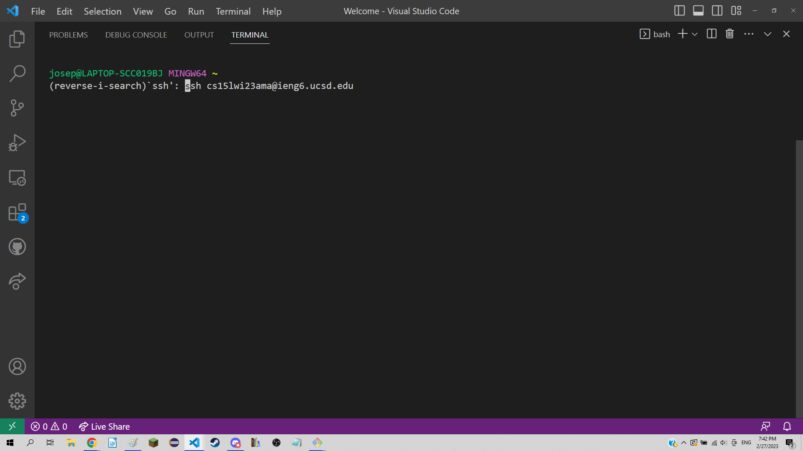
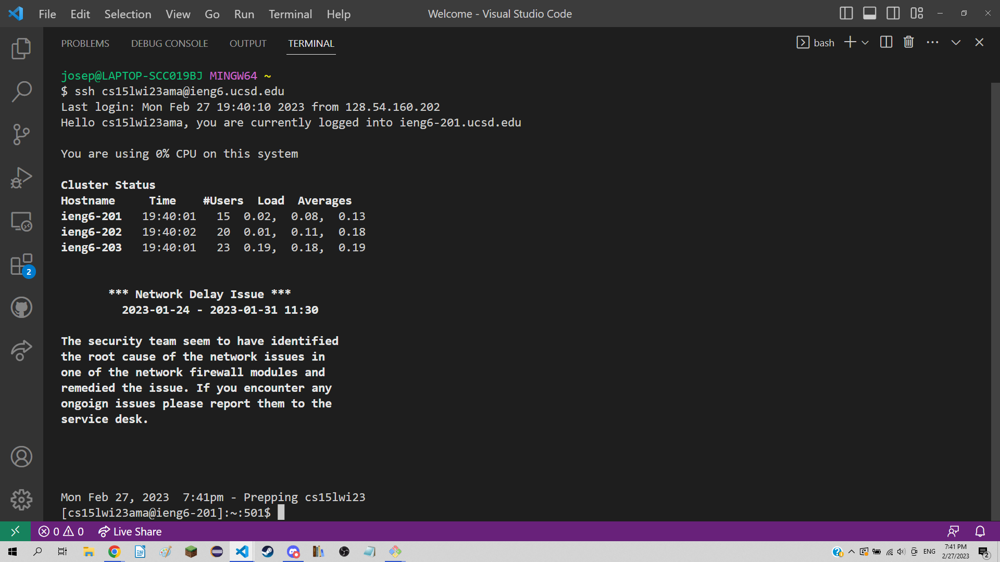
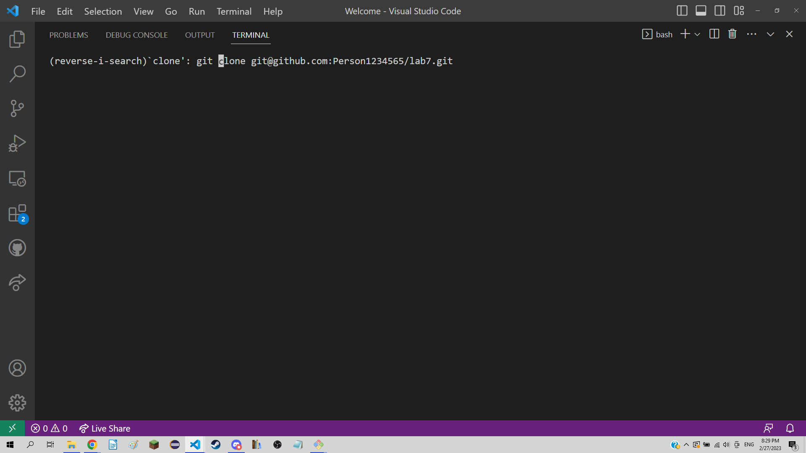
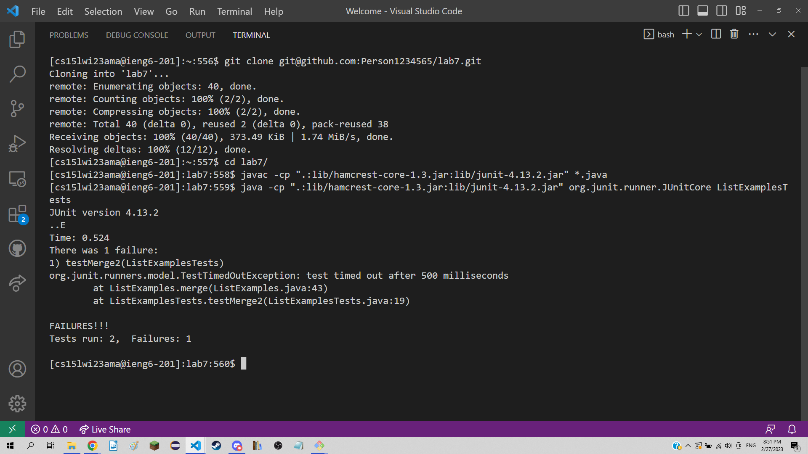
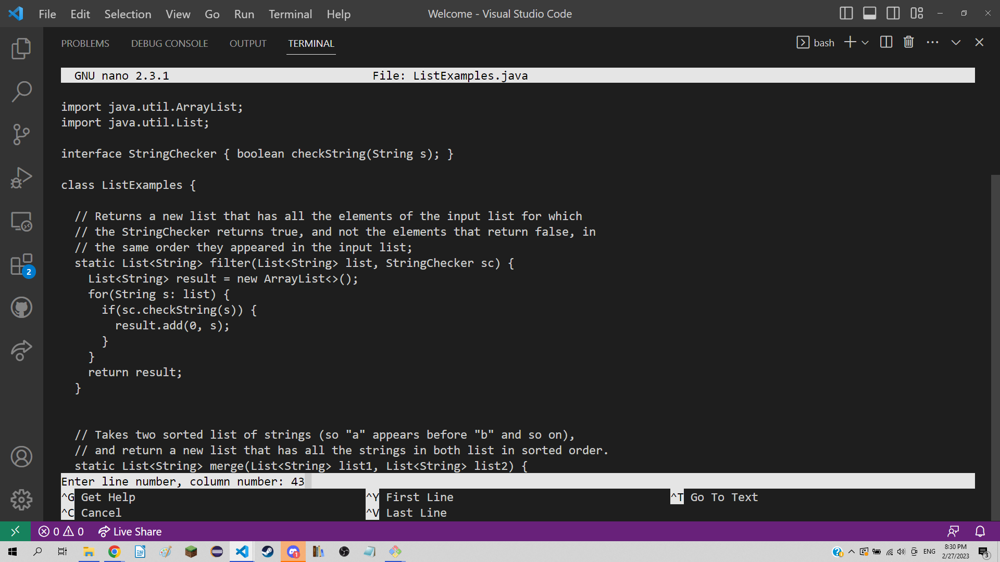
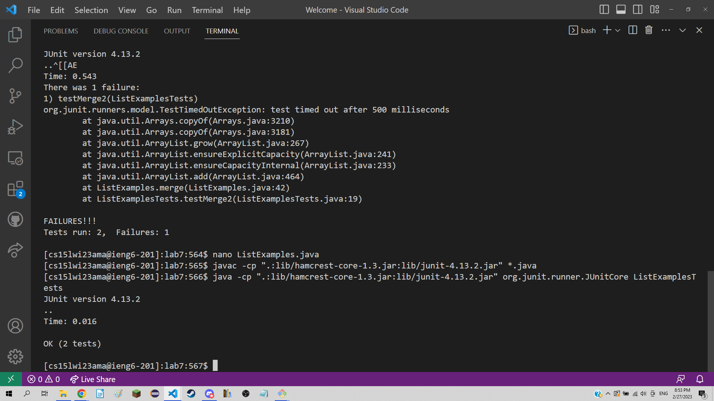
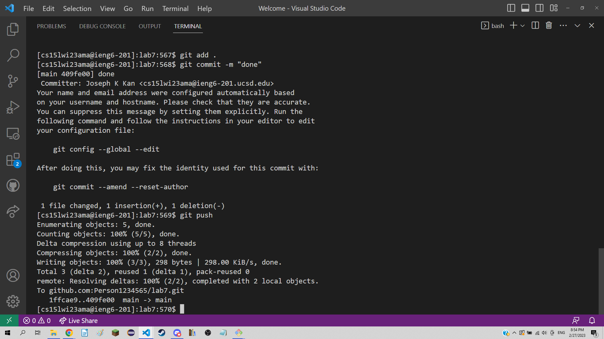

# CSE Labs "Done Quick"
## Log into ieng6  
  
  
  
  

  

Command used: `ssh cs15lwi23ama@ieng6.ucsd.edu`  
  
Keys pressed: `<ctrl + r> ssh <enter>`  
  
The command I used would log me into ieng6. I had run the command before, so I searched for it in my history with <ctrl + r> and the search string ssh. I had already setup the ssh automatic authentication as well, meaning I didn't have to enter my password and could simply press enter to login.  
  
 
## Clone your fork of the repository from your Github account  
  
  

Command used: `git clone git@github.com:Person1234565/lab7.git`
  
Keys pressed: `<ctrl + r> clone <enter>`  
  
The command I used clones my repository to ieng6. I had also ran this command before, so I used <ctrl + r> to search for it with keyword clone and pressed enter to execute the command.  
  
## Run the tests, demonstrating that they fail  
  
  
  
Commands used: `cd lab7/`  
               `javac -cp ".:lib/hamcrest-core-1.3.jar:lib/junit-4.13.2.jar" *.java`
               `java -cp ".:lib/hamcrest-core-1.3.jar:lib/junit-4.13.2.jar" org.junit.runner.JUnitCore ListExamplesTests`  
               
Keys pressed: `cd l <tab><enter><ctrl + r> javac <enter> <ctrl + r> runner <enter>`  

First, I changed my directory into the lab7 directory with cd. Then, I searched for the javac command with <ctrl + r> javac and pressed enter to compile all the java files. Finally, I searched for the command to run the tests by doing <ctrl + r> with keyword runner and pressed enter to run the tests. 
  
## Edit the code file to fix the failing test  
  
  
  
Commands used: `nano ListExamples.java`
  
Keys pressed: `<ctrl + r> nano <enter> <ctrl + shift + -> 43 <enter><right x 12><backspace> 2 <ctrl + o><enter><ctrl + x>`  

First, I used nano to open and edit ListExamples.java by searching for the previous command I used to enter nano and pressing enter. Then, I used <ctrl + shift + -> and entered 43 to jump to line 43 where I knew the error was. I pressed <right> 12 times to get to the column I wanted, backspaced and inputted 2 to fix the bug, and used <ctrl + o><enter> to save and <ctrl + x> to exit out of nano.    
  
## Run the tests, demonstrating that they now succeed  
  
  

Commands used: `javac -cp ".:lib/hamcrest-core-1.3.jar:lib/junit-4.13.2.jar" *.java`
               `java -cp ".:lib/hamcrest-core-1.3.jar:lib/junit-4.13.2.jar" org.junit.runner.JUnitCore ListExamplesTests`
  
Keys pressed: `<ctrl + r> javac <enter> <ctrl + r> runner <enter>`  
  
I searched for the javac command I used previously with <ctrl + r> and keyword javac again and pressed enter to compile. I searched for the java command by using <ctrl + r> and keyword runner and pressed enter to run the tests.     
  
## Commit and push the resulting change to your Github account  
  
  
  
Command used : `git add .`  
               `git commit -m "done"`
               `git push`  
  
Keys pressed: `<ctrl + r> add <enter><ctrl + r> commit <enter><ctrl + r> push <enter>`
  
I searched for each git command with <ctrl + r> and pressed enter to execute them. `git add .` added the changed files from the current directory to git. `git commit -m "done"` committed the changes and `git push` uploaded the changes to the remote repository on GitHub.    
